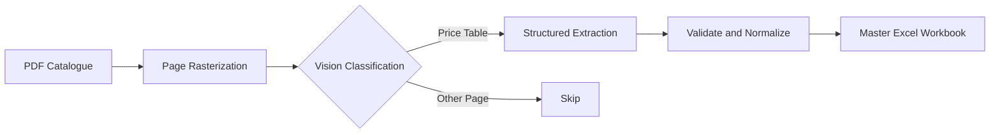
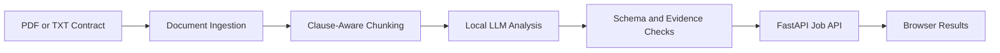

# Applied AI Agents Portfolio

A portfolio of practical AI systems designed to transform complex, unstructured business data into structured, reviewable, and actionable outputs.

This repository contains three independent projects:

1. **Catalog Vision Extractor** — converts visually inconsistent PDF product catalogues into a normalized Excel dataset.
2. **Contract Agent** — analyzes contracts clause by clause and presents structured risk findings through a FastAPI application.
3. **Sales Call Analysis Agent** — processes recorded sales calls through audio validation, normalization, transcription, diarization, transcript-speaker alignment, and progressive sales-performance analysis.

These projects focus on the engineering required around AI models—not only the model call itself. They cover ingestion, preprocessing, provider abstraction, structured outputs, validation, caching, failure isolation, testing, APIs, persistence foundations, and human review.

---

## Projects at a Glance

| Project                                                   | Business problem                                                                                                            | Core approach                                                                                                             | Interface                                 | Current stage                         |
| --------------------------------------------------------- | --------------------------------------------------------------------------------------------------------------------------- | ------------------------------------------------------------------------------------------------------------------------- | ----------------------------------------- | ------------------------------------- |
| [Catalog Vision Extractor](./catalog-vision-extractor/)   | Product and price data is trapped inside long, visually complex PDF catalogues.                                             | Vision-LLM page classification and structured extraction followed by deterministic normalization.                         | Python CLI and Excel output               | Functional, tested portfolio pipeline |
| [Contract Agent](./contract-agent/)                       | Important obligations and risks are difficult to identify quickly in long agreements.                                       | Clause-aware document chunking and structured local-LLM analysis with source evidence checks.                             | FastAPI API and browser UI                | Working local MVP                     |
| [Sales Call Analysis Agent](./sales-call-analysis-agent/) | Managers cannot manually review every sales call consistently or convert call recordings into measurable coaching insights. | Provider-independent audio, transcription, diarization, alignment, role assignment, and rubric-based evaluation pipeline. | Python package; API and dashboard planned | Active engineering build              |

---

# 1. Catalog Vision Extractor

Commercial catalogues often combine cover pages, marketing content, product descriptions, technical drawings, specifications, and price tables. Their layouts differ across brands, making fixed-coordinate and text-only extraction methods fragile.

The Catalog Vision Extractor renders each PDF page as an image, identifies pages containing price tables, extracts visible product rows into structured data, normalizes the results, and merges them into a consistent Excel workbook.

## Pipeline



## Diagram 

PDF catalogue → detected price page → extracted rows → final Excel sheet


## Engineering Highlights

* Page-level PDF processing with PyMuPDF
* Vision-based page classification
* Anthropic and OpenAI provider abstraction
* Structured model outputs validated with Pydantic
* Concurrent page classification and extraction
* Cache keys based on page content, prompt, and model
* Automatic cache invalidation after prompt or model changes
* Retry handling for transient API failures
* Detection of truncated model responses
* Per-page failure isolation
* Low-confidence review flags
* Deterministic normalization
* Duplicate and malformed-row handling
* Idempotent replacement by brand and price-list version
* Atomic Excel writes
* API-free unit tests
* GitHub Actions continuous integration

## Run It

```bash
cd catalog-vision-extractor

python -m venv .venv
source .venv/bin/activate
# Windows: .venv\Scripts\activate

pip install -r requirements.txt
```

Configure an Anthropic or OpenAI API key in your local environment, then process one catalogue:

```bash
python -m src.pipeline \
  --pdf data/input/acme_2026.pdf \
  --brand ACME \
  --version 2026
```

Process every PDF in the configured input directory:

```bash
python -m src.pipeline --all --version 2026
```

Force reprocessing without cached results:

```bash
python -m src.pipeline \
  --pdf data/input/acme_2026.pdf \
  --brand ACME \
  --version 2026 \
  --no-cache
```

The consolidated workbook is written to:

```text
catalog-vision-extractor/data/output/master_pricelist.xlsx
```

See the [project README](./catalog-vision-extractor/README.md) and [output schema](./catalog-vision-extractor/docs/schema.md) for detailed configuration, behavior, and limitations.

---

# 2. Contract Agent

Contract Agent is a local-first MVP for clause-level contract review.

It extracts text from PDF or TXT agreements, identifies clause boundaries, analyzes each clause with a locally stored language model, validates the structured response, and displays the findings through a lightweight browser interface.

The system is intended to help users locate important obligations, unusual terms, and potentially risky clauses more efficiently. It is a decision-support tool, not a replacement for professional legal review.

## Application Flow



## Diagram

Uploaded contract → clause analysis screen → structured risk result

## Engineering Highlights

* PDF and TXT ingestion
* Detection of empty or unsupported documents
* Scanned-document handling
* Structural clause splitting
* Sentence-boundary fallback
* Local Qwen2.5-7B inference through Transformers
* Structured clause verdicts
* Clause type, summary, obligations, and risk-level outputs
* Source-quote verification
* Rejection of unsupported risk evidence
* Per-clause failure isolation
* Progress callbacks
* In-memory background job queue
* Single-worker local-model processing
* Upload type and size validation
* FastAPI endpoints
* Lightweight responsive browser UI
* Unit and integration test organization

## Run It

The project targets Python 3.13 and expects access to a compatible local model.

```bash
cd contract-agent

python -m venv .venv
source .venv/bin/activate
# Windows: .venv\Scripts\activate

pip install -r requirements.txt
```

Place the local model in the expected project directory or configure its path through the environment.

Start the application:

```bash
uvicorn app.main:app --reload
```

Open the local interface at:

```text
http://127.0.0.1:8000
```

Interactive API documentation is available at:

```text
http://127.0.0.1:8000/docs
```

Run the tests:

```bash
pytest
```

See the [Contract Agent README](./contract-agent/README.md) for project-specific setup and implementation notes.

> **Responsible-use notice:** Contract Agent provides automated analysis for educational and decision-support purposes. Its output may be incomplete or incorrect and must be reviewed by a qualified legal professional before legal or business decisions are made.

---

# 3. Sales Call Analysis Agent

The Sales Call Analysis Agent is an engineering-focused system for converting recorded sales conversations into structured transcripts, speaker-aware dialogue, evaluation evidence, and eventually manager-facing performance insights.

The project is designed for organizations that need to review sales calls consistently but cannot manually listen to every recording.

Its target workflow includes:

* ingesting call recordings;
* validating and normalizing audio;
* generating timestamped transcripts;
* detecting speaker turns;
* aligning transcript segments with diarized speakers;
* assigning business roles such as seller and customer;
* evaluating calls against configurable sales rubrics;
* producing call-level and team-level reports.

## Target Pipeline


## Implemented Foundation

The current implementation includes the following completed or substantially implemented foundations:

* Domain models for calls, audio assets, metadata, and processing states
* Validated processing-state transitions
* Local-file ingestion
* File hashing and size validation
* Audio probing through `ffprobe`
* Privacy-aware exception handling and object representations
* Canonical ASR audio normalization through `ffmpeg`
* Deterministic normalized-file naming
* Post-conversion audio validation
* Provider-independent transcription contracts
* Hardened `faster-whisper` adapter
* Offline-first local ASR configuration
* Provider-independent diarization contracts
* Deterministic transcript-speaker alignment
* PostgreSQL 16 and pgvector development environment
* Alembic migration foundation
* Environment-based configuration
* Strict static typing
* Automated linting, formatting, and tests
* Architecture, specification, and decision documentation

## Current Development Path

The project is being developed as a sequence of explicit milestones.

### Completed foundation

1. Domain model and processing-state rules
2. Audio ingestion and probing
3. Canonical audio normalization
4. Provider-independent transcription
5. Hardened local `faster-whisper` integration
6. Provider-independent speaker diarization
7. Deterministic transcript-speaker alignment

### Current milestone

* Speaker-role assignment:

  * `SELLER`
  * `CUSTOMER`
  * `UNKNOWN`

### Planned milestones

* Persistent call and transcript storage
* Pipeline orchestration and background workers
* Upload and result APIs
* Knowledge-base ingestion
* Sales methodology and rubric representation
* Retrieval-augmented evaluation
* Evidence-grounded scoring
* Human-review workflow
* Call-level reports
* Team-level aggregation
* Management dashboard
* Observability, security, and production hardening

## Architecture

```text
sales-call-analysis-agent/
├── .cursor/
│   └── rules/                 # Repository development rules
├── docs/
│   ├── architecture.md        # System architecture
│   ├── decisions.md           # Architecture decision log
│   └── project-specification.md
├── migrations/                # Alembic database migrations
├── scripts/                   # Developer entry points
├── src/
│   └── sales_call_agent/
│       ├── aggregation/
│       ├── alignment/
│       ├── api/
│       ├── audio/
│       ├── diarization/
│       ├── domain/
│       ├── evaluation/
│       ├── infrastructure/
│       ├── ingestion/
│       ├── knowledge/
│       ├── knowledge_base/
│       ├── orchestration/
│       ├── persistence/
│       ├── rubric/
│       ├── speaker_identity/
│       └── transcription/
├── tests/
├── .env.example
├── alembic.ini
├── docker-compose.yml
├── pyproject.toml
└── README.md
```

## Development Setup

```bash
cd sales-call-analysis-agent

python -m venv .venv
source .venv/bin/activate
# Windows: .venv\Scripts\activate

pip install -e ".[dev]"
```

Install the optional local ASR dependencies:

```bash
pip install -e ".[asr,dev]"
```

Start the local PostgreSQL 16 and pgvector service:

```bash
docker compose up -d
```

Run the engineering checks:

```bash
ruff format --check .
ruff check .
mypy src
pytest
```

The local ASR integration tests are opt-in because they require a compatible model to be available locally.

For detailed design decisions and current implementation status, see:

* [Project README](./sales-call-analysis-agent/README.md)
* [Project specification](./sales-call-analysis-agent/docs/project-specification.md)
* [Architecture](./sales-call-analysis-agent/docs/architecture.md)
* [Decision log](./sales-call-analysis-agent/docs/decisions.md)

> **Privacy notice:** Sales recordings and transcripts may contain personal, confidential, or commercially sensitive information. Production use requires appropriate consent, access controls, retention policies, encryption, and jurisdiction-specific compliance review.

---

# Shared Engineering Themes

Although each project addresses a different business problem, the repository demonstrates several recurring engineering principles.

## Reliable AI Boundaries

Model responses are treated as untrusted external inputs. Structured outputs are validated before they enter downstream business logic.

## Provider Independence

Where practical, model-specific implementations are placed behind stable interfaces so the surrounding system does not depend directly on a single provider.

## Deterministic Processing

Normalization, hashing, schemas, cache rules, and explicit state transitions make probabilistic AI components easier to operate and test.

## Failure Isolation

A failed page, clause, audio segment, or provider call should not unnecessarily terminate an entire processing job.

## Human Review

AI outputs are designed to remain inspectable. Low-confidence results, source evidence, structured findings, and review states support human verification.

## Privacy-Aware Design

File paths, filenames, customer documents, contracts, audio recordings, transcripts, credentials, and model artifacts are treated as potentially sensitive.

## Testable Architecture

Core business logic is separated from external providers and infrastructure to support unit testing without requiring paid APIs, databases, or large local models.

---

# Technology Overview

## Languages and Application Layer

* Python
* FastAPI
* Uvicorn
* HTML
* JavaScript
* Jupyter Notebook

## AI and Machine Learning

* OpenAI APIs
* Anthropic APIs
* Vision-capable language models
* Qwen2.5
* Transformers
* PyTorch
* faster-whisper
* Provider-independent ASR and diarization interfaces

## Document and Audio Processing

* PyMuPDF
* PyPDF
* FFmpeg
* FFprobe

## Data and Persistence

* Pydantic
* pandas
* openpyxl
* JSON
* Excel
* PostgreSQL
* SQLAlchemy
* Alembic
* pgvector

## Engineering Tooling

* pytest
* Ruff
* mypy
* Docker Compose
* GitHub Actions
* Environment-based configuration

---

# Repository Structure

```text
Agents/
├── .github/
│   └── workflows/
├── catalog-vision-extractor/
│   ├── docs/
│   ├── src/
│   ├── tests/
│   └── README.md
├── contract-agent/
│   ├── app/
│   ├── src/
│   ├── tests/
│   └── README.md
├── sales-call-analysis-agent/
│   ├── docs/
│   ├── migrations/
│   ├── scripts/
│   ├── src/
│   ├── tests/
│   └── README.md
├── .gitignore
└── README.md
```

Each project is self-contained and maintains its own dependencies, documentation, setup instructions, tests, and development status.

---

# Portfolio Focus

This repository documents my work in applied AI engineering, particularly:

* AI agents for business workflows
* Multimodal document processing
* Vision-LLM pipelines
* Speech and audio intelligence
* Local and hosted model integration
* Structured extraction from unstructured data
* Retrieval-augmented evaluation
* Reliable orchestration around probabilistic systems
* Business-facing AI prototypes
* Human-review and decision-support systems

The central objective is not simply to call an AI model. It is to build the surrounding system required to make AI output operational, inspectable, and useful.

---

# Project Status

These are portfolio-scale and research-oriented implementations that continue to evolve.

| Project                   | Status                                                                                                             |
| ------------------------- | ------------------------------------------------------------------------------------------------------------------ |
| Catalog Vision Extractor  | Functional modular pipeline with classification, extraction, validation, caching, testing, and Excel export        |
| Contract Agent            | Working local MVP with clause analysis, background processing, FastAPI endpoints, and a browser interface          |
| Sales Call Analysis Agent | Active multi-stage engineering build with audio, transcription, diarization, and alignment foundations implemented |

They should not yet be interpreted as fully managed, production-ready SaaS products.

Production deployment would require additional work such as authentication, authorization, persistent job management, secrets management, monitoring, evaluation datasets, cost controls, security reviews, backup procedures, and deployment-specific infrastructure.

---

# Responsible Use

AI-generated extraction, transcription, classification, and analysis can be incomplete or incorrect.

Outputs should be treated as decision-support material and verified by a human with suitable domain expertise.

Do not commit any of the following to this repository:

* API keys or credentials
* `.env` files
* Private contracts
* Customer catalogues
* Sales recordings
* Call transcripts
* Personally identifiable information
* Proprietary model files
* Confidential business data

---

# Author

**Maedeh Torkian**

Data Science and Applied AI portfolio focused on machine learning, multimodal systems, NLP, AI agents, and reliable business-oriented automation.
