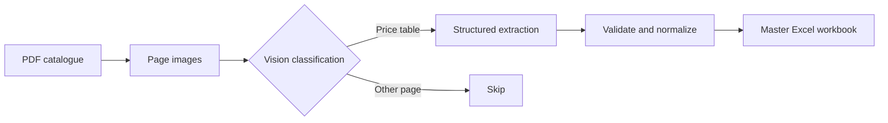
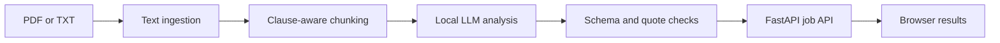

# Applied AI Agents Portfolio

[](https://github.com/Maee127/Agents/actions/workflows/catalog-vision-extractor-ci.yml)


A portfolio of practical AI systems that turn complex, unstructured documents into structured, reviewable outputs.

The repository contains two independent projects built around real business workflows:

- **Catalog Vision Extractor** converts visually inconsistent PDF product catalogues into a normalized master Excel workbook.
- **Contract Agent** analyzes PDF and text contracts clause by clause with a local language model and presents risk findings through a web application.

These projects focus on the engineering required around an AI model—not only the model call itself: ingestion, routing, structured outputs, validation, caching, concurrency, failure isolation, APIs, testing, and human review.

## Projects at a Glance

| Project | Business problem | AI approach | Interface | Stage |
| --- | --- | --- | --- | --- |
| [Catalog Vision Extractor](./catalog-vision-extractor/) | Product and pricing data is trapped in long, visually complex PDF catalogues. | Vision-LLM page classification and structured table extraction, followed by deterministic normalization. | Python CLI and Excel output | Functional, CI-tested portfolio pipeline |
| [Contract Agent](./contract-agent/) | Important obligations and risks are difficult to identify quickly in long agreements. | Clause-aware chunking and structured local-LLM analysis with source-quote verification. | FastAPI API and browser UI | Local MVP / experimental build |

## 1. Catalog Vision Extractor

Commercial catalogues often combine cover pages, product descriptions, technical drawings, specifications, and price tables. Their layouts differ across brands, making fixed-coordinate or text-only extraction fragile.

This project renders each PDF page as an image, identifies the pages that contain price tables, extracts every visible product row into validated JSON, normalizes the results, and merges them into a consistent Excel dataset.



### Engineering highlights

- Page-level processing with PyMuPDF
- Anthropic and OpenAI vision-provider abstraction
- Concurrent classification and extraction
- Pydantic validation at model-output boundaries
- Cache keys based on page content, prompt, and model
- Automatic cache invalidation after prompt or model changes
- Exponential retry handling for transient API failures
- Explicit detection of truncated model responses
- Per-page failure isolation and low-confidence review flags
- Deterministic normalization and duplicate-row handling
- Idempotent replacement by brand and price-list version
- Atomic Excel writes to protect the master workbook
- GitHub Actions CI and an API-free unit test suite

### Run it

```bash
cd catalog-vision-extractor

python -m venv .venv
source .venv/bin/activate
# Windows: .venv\Scripts\activate

pip install -r requirements.txt
cp .env.example .env
```

Add an Anthropic or OpenAI API key to `.env`, then process one catalogue:

```bash
python -m src.pipeline \
  --pdf data/input/acme_2026.pdf \
  --brand ACME \
  --version 2026
```

Or process every PDF in the input directory:

```bash
python -m src.pipeline --all --version 2026
```

The pipeline writes the consolidated workbook to:

```text
catalog-vision-extractor/data/output/master_pricelist.xlsx
```

For configuration, cache behavior, limitations, and detailed usage, see the [Catalog Vision Extractor README](./catalog-vision-extractor/README.md). The workbook fields are documented in the [schema reference](./catalog-vision-extractor/docs/schema.md).

## 2. Contract Agent

Contract Agent is a local-first MVP for clause-level contract review. It extracts text from PDF or TXT files, identifies clause boundaries, sends each clause to a locally stored Qwen2.5-7B model, validates the returned JSON, and displays the results in a lightweight browser interface.



### Engineering highlights

- PDF and TXT ingestion with scanned-document detection
- Structural clause splitting with a sentence-boundary fallback
- Local Qwen2.5-7B inference through Transformers
- Structured verdicts with clause type, summary, and risk level
- Source-quote verification to reject unsupported risk evidence
- Per-clause failure isolation
- Progress callbacks across the analysis pipeline
- In-memory job queue with single-worker model processing
- File-type, empty-file, and 20 MB upload validation
- Responsive browser UI with progress and risk filters
- Unit and integration test organization

### Run it

The project targets Python 3.13 and expects a local Qwen2.5-7B-compatible model directory.

```bash
cd contract-agent

python -m venv .venv
source .venv/bin/activate
# Windows: .venv\Scripts\activate

pip install -r requirements.txt
```

Place the model in `contract-agent/qwen2.5-7b/`, or set its location:

```bash
export LOCAL_MODEL_PATH=/absolute/path/to/qwen2.5-7b
```

Start the application:

```bash
uvicorn app.main:app --reload
```

Then open [http://127.0.0.1:8000](http://127.0.0.1:8000). Interactive API documentation is available at `/docs`.

For implementation notes and project-specific limitations, see the [Contract Agent README](./contract-agent/README.md).

> Contract Agent is a decision-support prototype, not legal advice. Its output must be reviewed by a qualified professional before any legal or business decision.

## Repository Structure

```text
Agents/
├── .github/
│   └── workflows/
│       └── catalog-vision-extractor-ci.yml
├── catalog-vision-extractor/
│   ├── data/
│   │   ├── cache/
│   │   ├── input/
│   │   └── output/
│   ├── docs/
│   │   └── schema.md
│   ├── src/
│   │   ├── cache.py
│   │   ├── classifier.py
│   │   ├── config.py
│   │   ├── exporter.py
│   │   ├── extractor.py
│   │   ├── normalizer.py
│   │   ├── pipeline.py
│   │   ├── rasterizer.py
│   │   ├── schemas.py
│   │   └── vision_client.py
│   ├── tests/
│   ├── .env.example
│   ├── README.md
│   └── requirements.txt
├── contract-agent/
│   ├── app/
│   │   ├── static/
│   │   │   └── index.html
│   │   └── main.py
│   ├── src/
│   │   ├── analyzer.py
│   │   ├── chunking.py
│   │   ├── ingestion.py
│   │   ├── local_llm.py
│   │   └── pipeline.py
│   ├── tests/
│   │   ├── fixtures/
│   │   ├── integration/
│   │   └── unit/
│   ├── README.md
│   ├── pytest.ini
│   └── requirements.txt
└── README.md
```

Each project is self-contained. Install and run it from its own directory using its own dependency file.

## Technical Themes

| Area | Patterns demonstrated |
| --- | --- |
| AI orchestration | Multi-stage pipelines, model routing, prompt-specific processing |
| Trust and reliability | Schema validation, source grounding, low-confidence flags, failure isolation |
| Data engineering | Normalization, deduplication, idempotent updates, structured export |
| Performance | Concurrent page processing, caching, local-model reuse |
| Application delivery | CLI workflows, REST endpoints, background jobs, browser UI |
| Quality | Unit tests, integration tests, CI, environment-based configuration |

## Current Scope

This is a portfolio repository, not a hosted multi-tenant service.

- The catalogue extractor requires a supported vision API and should be evaluated against representative catalogues before production use.
- The contract agent requires a local model, keeps jobs in memory, and processes them sequentially in a single application process.
- Authentication, persistent job storage, observability, deployment infrastructure, and production security controls are outside the current scope.

## Responsible Use

AI-generated extraction and analysis can be incomplete or incorrect. Treat all outputs as reviewable decision-support data and verify important results against the source document.

Never commit API keys, model files, private contracts, customer catalogues, generated caches, or exported business data to the repository.
